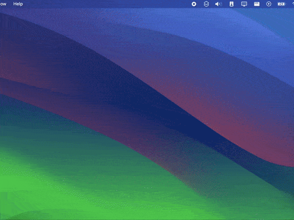

# Base64 Encoder iOS Shortcut

### Convert image files into Base64 format easily.

This iOS shortcut helps you encode image files into base64 format, making it quick and easy to copy the encoded data to your clipboard for use in web development, emails, or other projects.

## Shortcut Demo

## Features:

- Supports PNG, JPG, and GIF formats.
- Automatically copies the encoded data to the clipboard.
- Custom alert to inform you once the conversion is completed.

## Installation:

1. Download the shortcut by [clicking here](<[iCloudLinkToShortcut](https://www.icloud.com/shortcuts/fb18fa048a5f43f9a04e4d6813b826fd)>).
2. Open it in your iOS Shortcuts app.
3. Allow necessary permissions for file access.

## How to Use:

1. Open the shortcut and select an image file.
2. The shortcut will automatically detect the file type and encode it in base64.
3. The encoded base64 data will be copied to your clipboard for use.

## Screenshots:

## Contributing: 

Feel free to contribute by submitting issues or pull requests to improve this shortcut.

## License:

Licensed under the [MIT License](LICENSE). 
